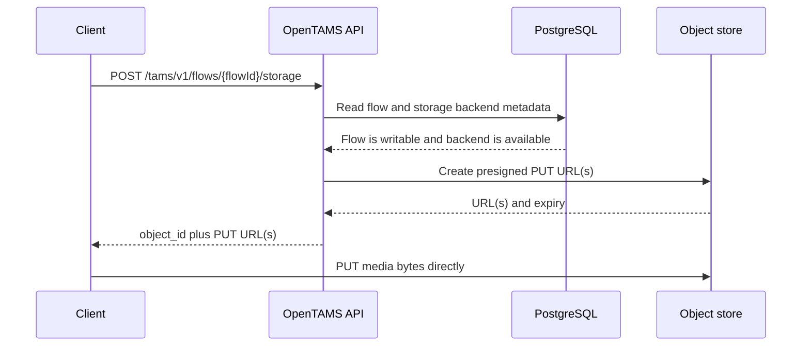
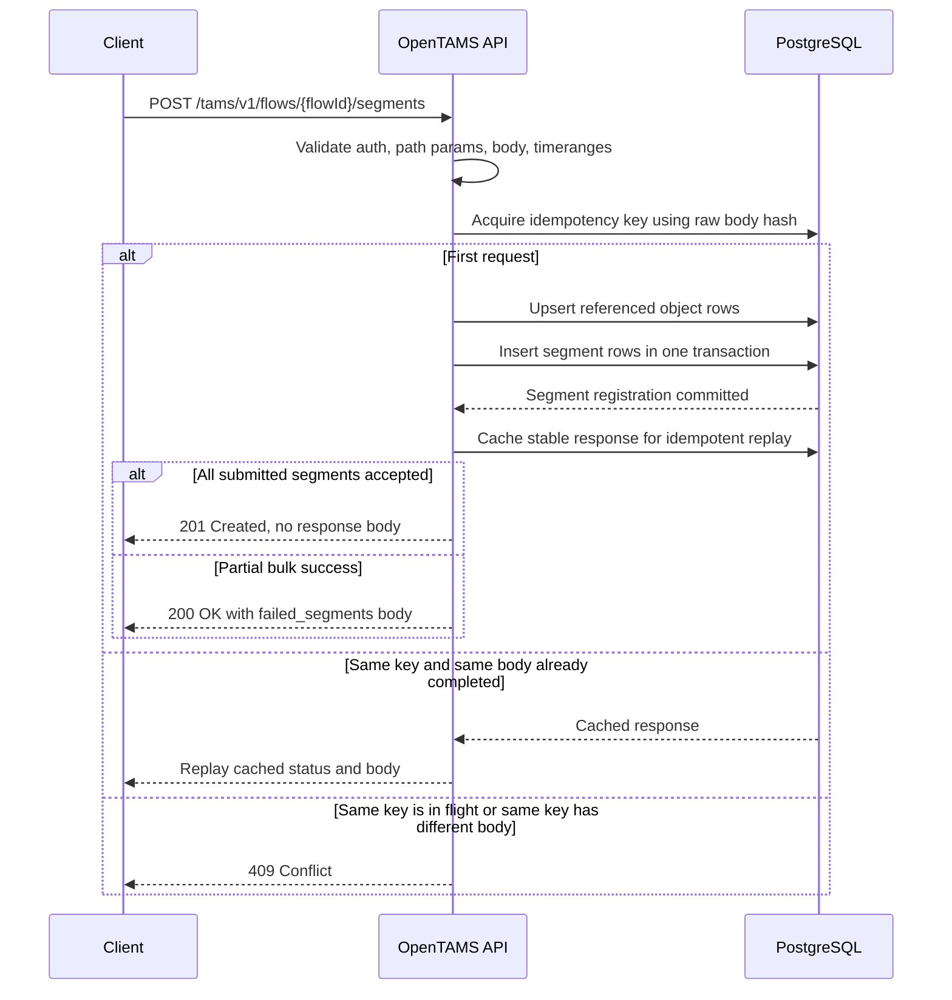
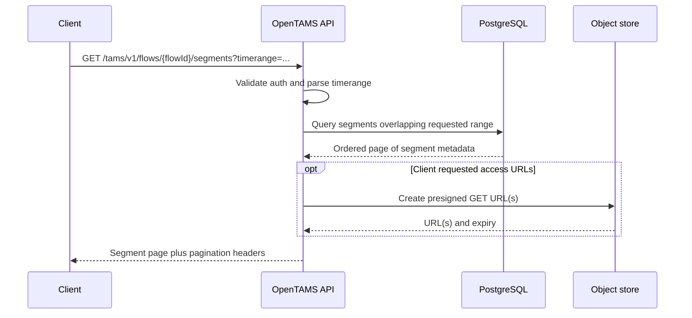
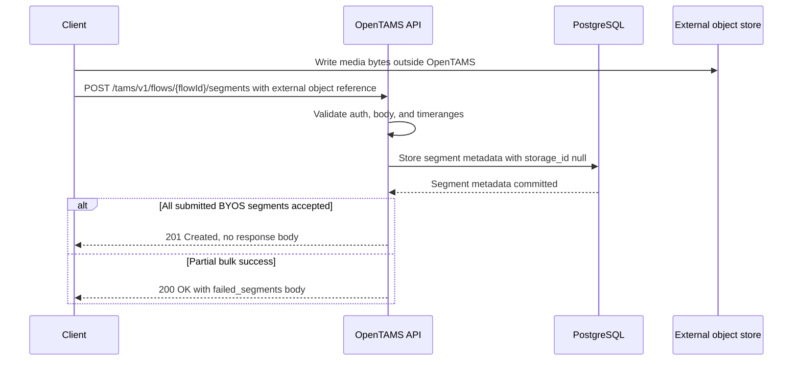
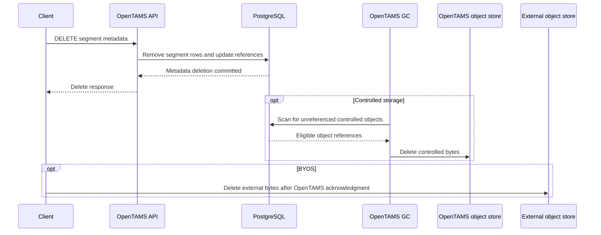
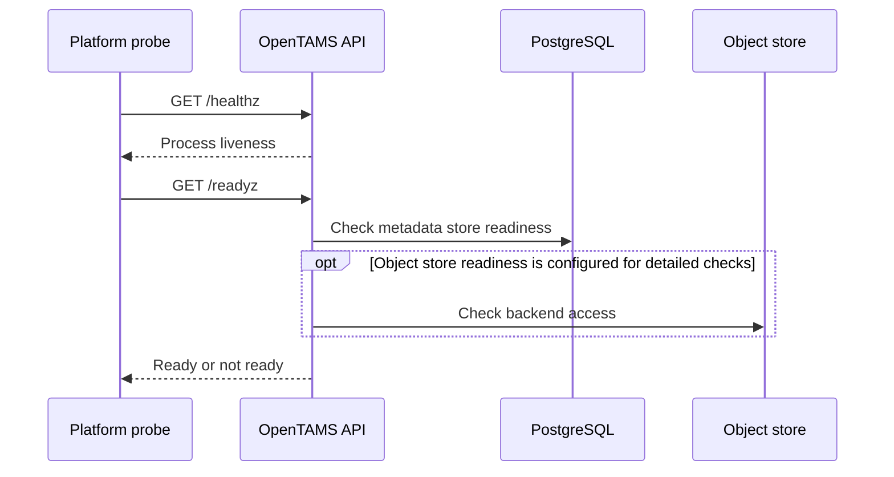

# OpenTAMS Data Flows

This document describes the main API flows at the system level. It avoids Go package names and focuses on what each deployed component does.

For the exact wire contract, see the bundled OpenAPI document in `[api/opentams-api-bundled.yaml](../../api/opentams-api-bundled.yaml)`. For implementation details, see the [codebase guide](../development/codebase.md).

## Allocate Controlled Storage

Storage allocation does not make bytes pass through OpenTAMS. The API returns presigned PUT URLs and the client uploads directly to the object store. Object metadata is not finalized by allocation alone; an object becomes tracked when a segment references it.

## Register Segments

Segment registration is the point where OpenTAMS records object references. The metadata transaction preserves the relationship between flows, segments, and referenced objects, and the idempotency record makes safe retries possible for clients.

A full-success registration returns `201 Created` with no response body. `200 OK` is reserved for partial bulk success: array input where at least one segment was registered and at least one non-overlap per-segment validation error is returned in the `failed_segments` body. Whole-request failures use error responses such as `400 Bad Request` or `422 Unprocessable Entity`. Idempotency replay returns the original cached status and body.

## List Segments By Time Range

The metadata query uses stored time bounds and keyset pagination. If object access URLs are requested, OpenTAMS signs GET URLs; clients still download media bytes directly from the object store.

## Register BYOS Segments

For BYOS objects, OpenTAMS stores the metadata reference but does not own the bytes. BYOS uses the same `POST /segments` status rules as controlled storage: `201 Created` for full success, and `200 OK` only for partial bulk success. Garbage collection does not delete external media.

## Delete Segments And Reclaim Bytes

Segment deletion is a metadata operation on the request path. Byte deletion belongs to the separate GC component and only applies to controlled storage. BYOS references are outside OpenTAMS ownership, so clients are responsible for deleting external bytes after OpenTAMS acknowledges the segment metadata delete. The ordering matters: deleting BYOS bytes before deleting TAMS metadata can leave visible segment references that point to missing media.

## Health And Readiness

Health endpoints are operational control surfaces. They do not change TAMS metadata and are separated from the media data plane.