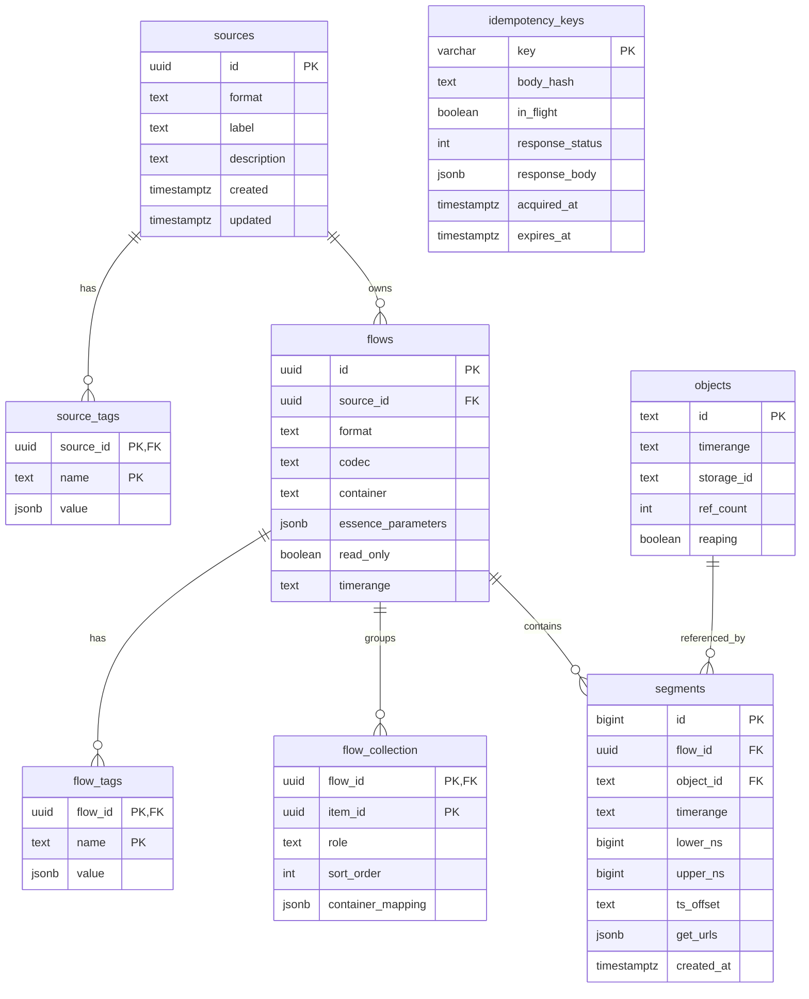

# OpenTAMS Metadata Model

OpenTAMS stores TAMS metadata in PostgreSQL. This document shows the logical metadata model: what each entity represents and how the entities relate. The migration files under [`migrations/`](../../migrations/) remain the source of truth for physical columns, indexes, and constraints.

For request sequences, see [data flows](data-flows.md). For implementation package boundaries, see the [codebase guide](../development/codebase.md).

## Entity Relationship Diagram

## Core Entities

| Entity | Meaning |
|---|---|
| `sources` | A TAMS source. Sources group one or more flows that represent related media essence. |
| `flows` | A TAMS flow. Flows carry format, codec/container metadata, timing metadata, and read-only state. |
| `segments` | Time-addressed media metadata for a single flow. A segment points to one object and occupies a timerange. |
| `objects` | Object references used by segments. Objects may represent OpenTAMS-controlled bytes or bring-your-own-storage bytes. |
| `idempotency_keys` | Request lifecycle state for idempotent writes. This protects retries; it is not part of the TAMS domain model. |

## Tags And Collections

`source_tags` and `flow_tags` store name/value metadata attached to sources and flows. They are deleted with their parent source or flow.

`flow_collection` records collection membership for a flow. The `item_id` is intentionally modeled as an item reference rather than a foreign key to one table, because collection entries can represent different item types in the TAMS model.

## Segment Time Model

Segments keep both the API timerange string and normalized nanosecond bounds:

- `timerange` preserves the TAMS wire representation.
- `lower_ns` and `upper_ns` support efficient time-range queries.
- `upper_ns` can be `NULL` for open-ended ranges.

At write time PostgreSQL enforces that two segments on the same flow cannot overlap. At read time OpenTAMS can find overlapping segments with indexed bound comparisons.

## Object Ownership Model

The `objects.storage_id` column is the ownership marker:

| `objects.storage_id` | Meaning | Byte ownership |
|---|---|---|
| Non-null | Controlled storage | OpenTAMS issued the storage URL and may delete bytes through GC when unreferenced. |
| `NULL` | BYOS | The client supplied external object access; OpenTAMS stores metadata only and does not delete bytes. |

`objects.ref_count` tracks how many segment rows currently reference the object. When it reaches zero, controlled objects become eligible for garbage collection. BYOS objects are skipped by OpenTAMS GC.

`objects.reaping` is a GC claim flag. It prevents a race where one process is deleting an unreferenced controlled object while another request tries to attach a new segment to the same object id.

## Idempotency State

`idempotency_keys` stores write-retry state keyed by `X-Idempotency-Key`.

It records:

- the raw request body hash,
- whether the first request is still in flight,
- the cached stable response for replay,
- acquisition and expiry timestamps.

This table does not have foreign keys to domain tables. It protects request processing and is periodically pruned.

## Physical Schema Notes

The logical model above intentionally omits most implementation detail. The PostgreSQL migrations add the physical behavior needed by the service:

- `segments_flow_lower` supports segment listing by flow and lower time bound.
- `no_segment_overlap` prevents overlapping segment timeranges within a flow.
- `flows_essence_gin` supports JSONB lookup over flow essence parameters.
- `idempotency_keys_expires` and `idempotency_keys_inflight_acquired` support idempotency pruning and stale in-flight cleanup.
- `objects_gc_claim_idx` and `objects_gc_retry_idx` support efficient GC claiming and retry scans.

When this document and a migration disagree, the migration is authoritative.
