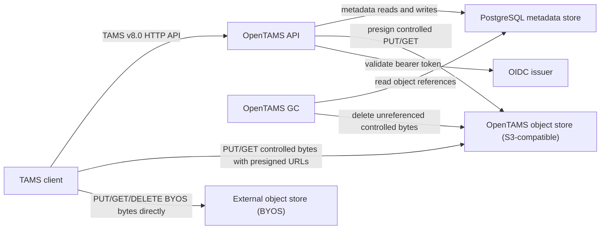
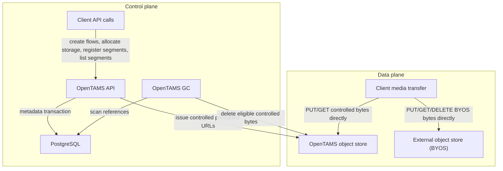
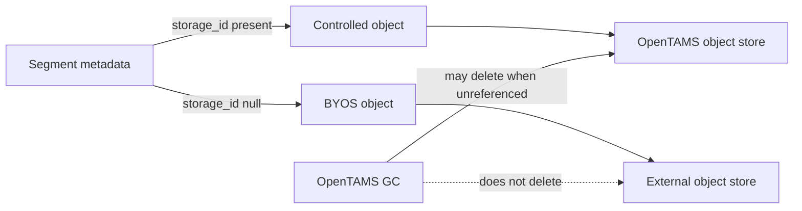
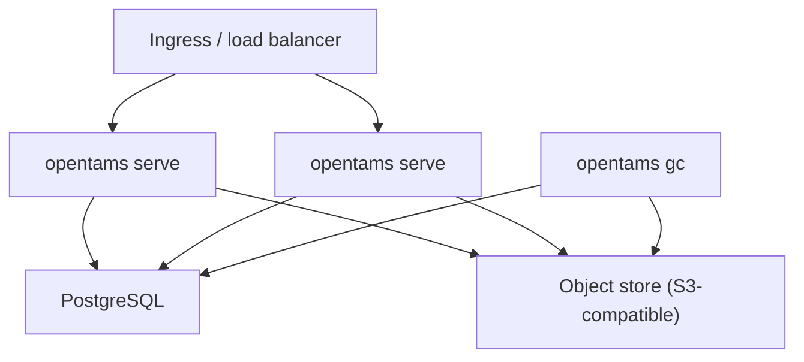

# OpenTAMS Architecture Overview

OpenTAMS is a cloud-agnostic implementation of the BBC Time-Addressable Media Store (TAMS) v8.0 API. It stores metadata in PostgreSQL, uses an S3-compatible object store for media bytes, and keeps OpenTAMS itself out of the media data path.

This document is intentionally high level. It describes OpenTAMS as a deployed system, not as a set of Go packages. For implementation boundaries, see the [codebase guide](../development/codebase.md).

## System Context

OpenTAMS owns the API contract, metadata consistency, idempotency, authorization boundary, and storage URL issuance. It does not proxy media bytes. For controlled storage, clients upload and download bytes directly against the OpenTAMS object store with URLs issued by OpenTAMS. For BYOS(Bring Your Own Storage), clients manage bytes in an external object store and send references to OpenTAMS through the TAMS API; OpenTAMS records the metadata but does not access or delete those bytes.

## Main Components

| Component                    | Role                                                                                                             |
| ---------------------------- | ---------------------------------------------------------------------------------------------------------------- |
| TAMS client                  | Any client that speaks the BBC TAMS v8.0 HTTP API.                                                               |
| OpenTAMS API                 | Stateless HTTP service for flows, sources, segments, storage allocation, health, metrics, and auth checks.       |
| PostgreSQL metadata store    | Durable metadata for sources, flows, segments, idempotency records, object references, and storage backend rows. |
| OpenTAMS object store        | Durable controlled media bytes. OpenTAMS signs URLs for clients; clients move bytes directly.                    |
| External object store (BYOS) | Client-managed media bytes referenced by segment metadata. OpenTAMS does not access or delete these bytes.       |
| OpenTAMS GC                  | Separate process for cleaning up unreferenced controlled objects.                                                |
| OIDC issuer                  | External identity provider used to validate bearer tokens. Development mode can use a fixed dev principal.       |

## Control Plane vs Data Plane

The API server is on the control plane. It validates requests, applies TAMS rules, stores metadata, and signs URLs for controlled object storage. Object stores are on the data plane. For BYOS, clients manage external bytes directly and OpenTAMS only records metadata references. This split keeps API throughput independent of media object size.

## Storage Ownership

OpenTAMS supports two object ownership modes:

| Mode                          | Storage ID | Bytes stored in                                   | Who deletes bytes                                             |
| ----------------------------- | ---------- | ------------------------------------------------- | ------------------------------------------------------------- |
| Controlled storage            | Present    | OpenTAMS-configured object store                  | OpenTAMS GC, once no segment references remain for the object |
| Bring your own storage (BYOS) | `null`     | External object location referenced by the client | External owner                                                |

Controlled objects are eligible for OpenTAMS-managed garbage collection. BYOS objects are metadata references only; OpenTAMS never assumes ownership of those bytes. For BYOS deletion, clients should delete the segment metadata through OpenTAMS first and wait for the OpenTAMS acknowledgment before deleting the external media bytes. Deleting BYOS bytes first can leave live TAMS metadata pointing at missing media.

## Deployment Shape

`opentams serve` instances are stateless and can be horizontally scaled behind a load balancer. PostgreSQL and the object store provide durability. The GC process is deployed separately from API serving so media-byte cleanup does not block request handling.

## Related Documents

- [Data flows](data-flows.md) describes request sequences for storage allocation, segment registration, listing, and deletion.
- [Metadata model](metadata-model.md) describes PostgreSQL entities, relationships, and object ownership semantics.
- [Configuration](../configuration.md) documents environment variables and backend configuration.
- [Conformance](../conformance.md) tracks implemented, partial, deferred, and out-of-scope TAMS API surfaces.
- [Codebase guide](../development/codebase.md) explains the Go packages and extension points.

