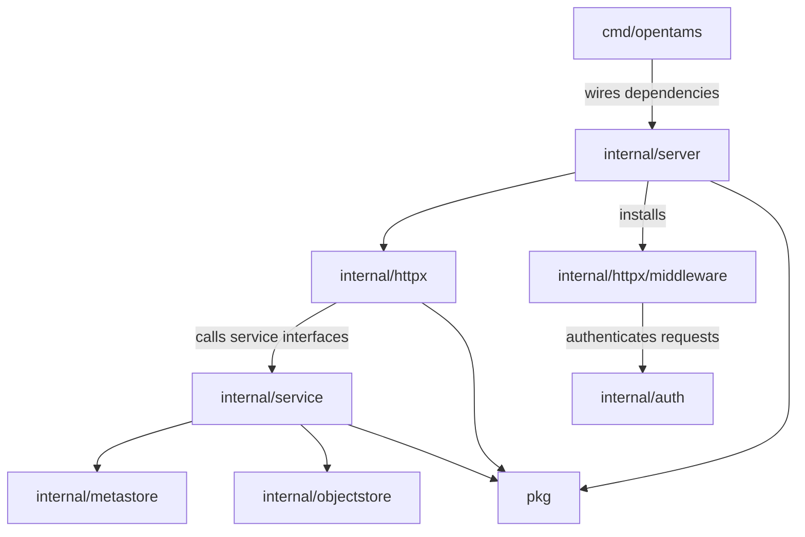
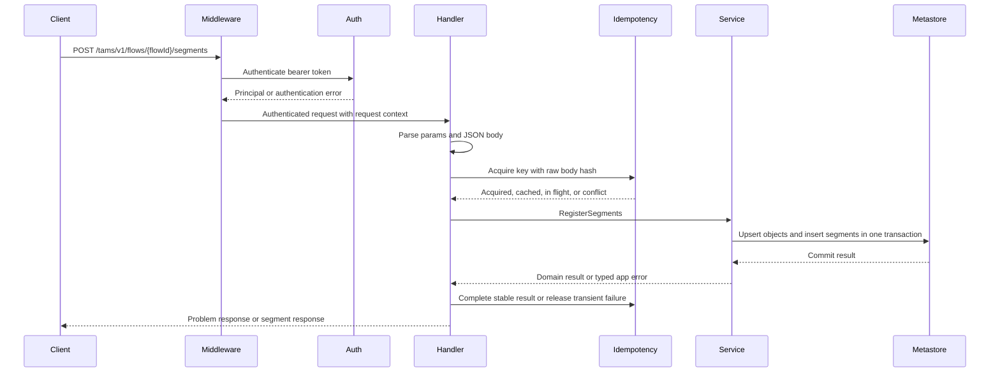
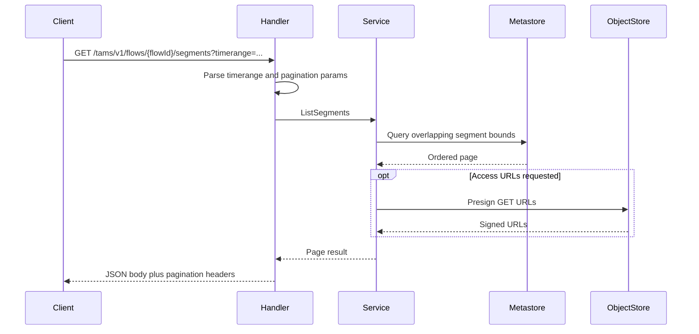

# OpenTAMS Codebase Guide

This guide explains how OpenTAMS is put together in Go: package boundaries, dependency direction, extension points, and the best reading order for contributors.

For high-level system diagrams and deployed API flows, see the [architecture overview](../architecture/overview.md) and [data flows](../architecture/data-flows.md).

## Component Overview

The codebase is deliberately layered:

| Layer | Lives in | Knows about |
|---|---|---|
| Entry point | `cmd/opentams/` | All other layers; does dependency wiring. |
| HTTP transport | `internal/server/`, `internal/httpx/` | Service interfaces and auth middleware; never reaches into storage directly. |
| Service / business logic | `internal/service/{flow,segment,storage}/` | Metastore/object-store interfaces and business-rule inputs; does not authenticate requests. |
| Backend adapters | `internal/metastore/`, `internal/objectstore/`, `internal/auth/` | Concrete drivers and external SDKs. Auth is used by HTTP middleware, not by services. |
| Reusable libraries | `pkg/` | Standard library and third-party deps. Non-test code under `pkg/` must not import `internal/`. |

Reads flow downward. Anything in `pkg/` is reusable by external consumers; anything under `internal/` is OpenTAMS-specific and not a public Go API.

## Backend Interfaces

OpenTAMS keeps persistence, object access, and caller identity behind narrow interfaces. Replacing a backend should mean adding an implementation, not changing handlers or service rules. Auth is the exception to the service-call path: it is wired into the HTTP middleware so unauthenticated requests are rejected before handlers call services.

### Metastore

`internal/metastore` owns sources, flows, segments, idempotency keys, object references, and storage backend rows.

- Production driver: PostgreSQL via `pgx/v5`.
- Schema: migrations live under `migrations/`.
- Important invariant: segment registration must atomically upsert referenced objects and insert segment rows so segment foreign keys cannot race concurrent requests.
- Time-range reads use stored nanosecond bounds and indexed comparisons. Write-time overlap prevention relies on PostgreSQL exclusion semantics.

### Object Store

`internal/objectstore` owns presigned URL generation and object deletion/listing.

- Production driver: AWS SDK v2 against any S3-compatible endpoint.
- Clients PUT and GET media directly using presigned URLs. OpenTAMS is not a byte proxy.
- Alternative backends need equivalent signed URL semantics.

### Auth

`internal/auth` owns caller identity for the HTTP boundary.

- Production driver: JWT validation against external and optional internal OIDC issuers.
- Development driver: a fixed dev principal when development auth is enabled.
- Alternative providers can be mTLS, SigV4, internal sessions, or any mechanism that can return a principal for an HTTP request.
- Dependency direction: `internal/server` receives an `auth.Provider`, installs `internal/httpx/middleware.Auth`, and the middleware calls `Authenticate`. `internal/service` does not import or call `internal/auth`.

## Segment Registration Path

Segment registration is the most spec-loaded write path and a good way to understand the repository.

A retry with the same `X-Idempotency-Key` and the same raw body bytes replays the cached response within the TTL. A retry with the same key but different body bytes returns conflict.

## Time-Range Query Path

The read path is an indexed metadata query. Media bytes are fetched by clients directly from object storage when URLs are requested.

## Idempotency

`internal/idempotency` exists because segment registration retries are part of the public API contract, not a best-effort optimization.

| Status | Meaning | Caller behavior |
|---|---|---|
| `StatusAcquired` | First request with this key, or a previous record expired. | Proceed and later `Complete` or `Release`. |
| `StatusCached` | Same key and same body hash already completed. | Replay the cached response. |
| `StatusInFlight` | Same key and same body hash are still processing elsewhere. | Return 409 Conflict. |
| `StatusConflict` | Same key with a different body hash. | Return 409 Conflict. |

The body hash is over the raw request bytes. There is no JSON canonicalization, so a retry should reuse the same serialized body.

The idempotency reaper is separate from object garbage collection. Reaping expired idempotency rows does not delete media bytes.

## Where To Start Reading

If you are new to the codebase, read in this order:

1. `cmd/opentams/main.go` and `cmd/opentams/serve.go` - entry point and dependency wiring.
2. `api/opentams-api-v1.yaml` - source API contract.
3. `internal/httpx/handlers/segments.go` - the most spec-loaded handler.
4. `internal/service/segment/segment.go` - segment business rules.
5. `internal/metastore/segments.go` - persistence behavior.
6. `migrations/000001_init.up.sql` - schema and constraints.

For reusable libraries, package comments and godoc are the best entry point. The current `pkg/` surface is:

| Package | Purpose |
|---|---|
| `pkg/dbmigrate` | `golang-migrate` wrapper with embedded filesystem support and zap logging. |
| `pkg/httpmetrics` | Gin middleware for Prometheus HTTP request duration/count metrics. |
| `pkg/httplog` | Gin access logging with request-scoped log fields. |
| `pkg/httprecovery` | Panic recovery contracts; `pkg/httprecovery/ginadapter` adapts them to Gin. |
| `pkg/jwtauth` | Generic JWKS-backed JWT validation against one or more issuers. |
| `pkg/logger` | Zap logger construction and context helpers. |
| `pkg/metrics` | Prometheus registry construction and namespaced registerers. |
| `pkg/requestid` | Request correlation ID helpers; `pkg/requestid/ginadapter` adapts them to Gin. |

## Extension Points

The expected contribution points are:

- New metastore driver: implement the metastore interface while preserving transaction semantics and segment overlap invariants.
- New object-store driver: implement presigned PUT/GET URL behavior and object deletion/listing.
- New auth provider: implement principal extraction and validation.
- New HTTP middleware: use `pkg/<name>` for reusable middleware, or `internal/httpx/middleware` for OpenTAMS-specific middleware.

For spec changes, edit the OpenAPI document first, regenerate the generated API bindings, then implement the handler and service behavior. The generated code is how the repository keeps the wire contract and implementation aligned.

## JSON response encoding (HTML escaping)

Response bodies are written by the oapi-codegen strict-server `VisitXxxResponse` encoders, which call `json.NewEncoder(w).Encode(...)`. Go's `encoding/json` HTML-escapes `&`, `<`, `>` to `\u0026`, `\u003c`, `\u003e` by default, so those characters appear escaped on the wire — most visibly in presigned object-store URLs, whose signed query strings are full of `&`. This is valid JSON; every parser decodes it transparently. See the consumer-facing note in [Conformance → JSON response encoding](../conformance.md#json-response-encoding).

We deliberately **do not** change the server, and this note exists so the decision is not re-litigated:

- It is purely cosmetic — the bytes are spec-valid JSON, and only raw-bytes / copy-paste consumers (e.g. `curl` to a file) ever notice.
- The only clean encoder-level fix is disabling `SetEscapeHTML` on the ~265 generated `VisitXxxResponse` encoders, which means **mutating generated code** in place. The repo's codegen post-processing is otherwise strictly additive — `genunionbridges` emits a sibling file and never edits the generated one — so this would set a new precedent and add regen-fragility.
- A response middleware that un-escapes on the way out avoids touching generated code, but it buffers every response (defeating the encoder's direct streaming) and risks reordering keys / reformatting numbers if done via re-encode.
- A non-strict server would have made this a one-line `c.PureJSON`, but the strict server's compile-time-checked request/response types are worth keeping.

`tamsctl` handles it client-side instead: `tamsctl -o json` decodes the escapes in `cmd/tamsctl/output.go` (`decodeHTMLEscapes`); `-o yaml`/`-o table` already decode via `Unmarshal`. If a future requirement demands literal `&` in raw API bytes, the response-middleware route is the no-codegen-edit option.

## Related Documents

- [Architecture overview](../architecture/overview.md) - high-level system shape.
- [Data flows](../architecture/data-flows.md) - API flow sequences.
- [Conformance](../conformance.md) - implemented and deferred TAMS surfaces.
- [Configuration](../configuration.md) - environment variables and deployment configuration.
